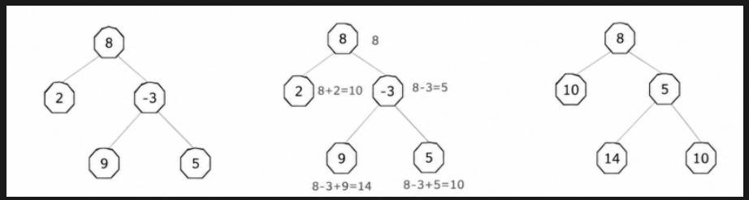
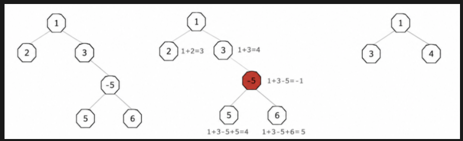

# P5128.第3题-容器镜像Top-K大小统计
时间限制：1000ms
## 题目内容
在容器镜像管理系统中，容器镜像通常采用堆叠方式管理和挂载，为了减少镜像管理系统中重复的镜像层数量，假定容器镜像层采用二叉树管理。镜像层二叉树节点描述镜像层大小，节点的镜像完整大小为镜像层大小及其所有父节点镜像层大小之和。由于业务需要，现在需要对系统中所有的客户镜像大小统计分析，从小到大输出最大的 $K$ 个镜像大小；输入为容器镜像二叉树前序遍历数组和中序遍历数组，输出为最大的 $K$ 个镜像大小，并按从小到大排序输出。

说明：当镜像完整大小小于等于 $0$ 时，则表示该镜像节点异常，异常镜像节点需要剪枝；例如：节点 $A$ 有子节点 $B$ 和子节点 $C$，如果节点 $A$ 完整镜像大小为 $0$，则节点 $A$ 需要剪枝，即节点 $A$、节点 $B$、节点 $C$均需要从镜像二叉树中删除。

## 输入描述
第一行：容器镜像树前序遍历结果。
第二行：容器镜像树中序遍历结果。
第三行：需要统计的最大容器镜像个数 $K$，取值范围为 $[1,1000]$。

说明：
1. 容器镜像树前序遍历、中序遍历结果中的数字表示当前镜像层大小，取值范围为 $[-10000,10000]$。
2. 镜像层大小为负数时表示该层基于父镜像裁剪文件，镜像层为正数时表示该层基于父镜像新增文件，$0$ 则表示镜像层未做任何更改或者裁剪文件大小与新增文件大小相等；
3. 节点规模数量 $\le1000$。
4. 输入的各节点镜像层大小都不相同，保证前序+中序可以还原唯一二叉树。

## 输出描述
从小到大输出最大的 $K$ 个镜像大小。

补充说明：
1. 如果二叉树剪枝后有效节点总数小于 $K$，则从小到大输出所有有效镜像大小。
2. 如果二叉树剪枝后无有效节点，则输出 `null`。

## 样例1
### 输入
```
8 2 -3 9 5
2 8 9 -3 5
3
```
### 输出
```
10 10 14
```
### 说明

根据前序 `8 2 −3 9 5`、中序 `2 8 9 −3 5` 还原二叉树，每个节点存储镜像层大小；
每个节点完整镜像大小 = 当前节点层大小 + 所有祖先节点层大小。
全部5个节点的镜像完整大小分别为：$8,10,5,14,10$。
取TOP3最大数值，再升序排列，得到 `10 10 14`。

## 样例2
### 输入
```
1 2 3 -5 5 6
2 1 3 5 -5 6
1
```
### 输出
```
4
```
### 说明

还原原始二叉树后，节点 $-5$ 计算得到完整镜像大小为 $-1$（$\le0$），触发整棵子树剪枝；
剪枝后剩余3个有效镜像，取TOP1最大数值为 $4$。