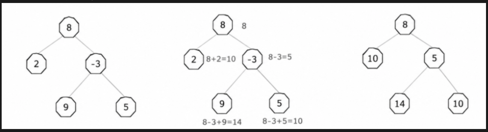
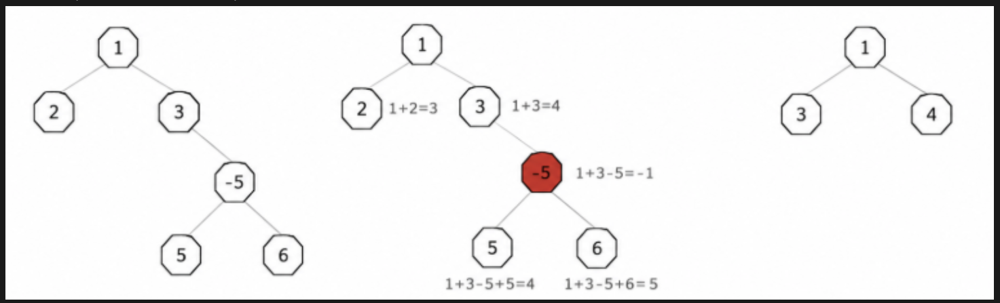

# P5114.第2题-容器镜像平均大小统计
## 题目内容
在容器镜像管理系统中，容器镜像通常采用堆叠方式管理和挂载，为了减少镜像管理系统中重复的存储量，假定容器镜像层采用二叉树管理。镜像层二叉树节点描述镜像层大小，节点的镜像完整大小为镜像层大小及其所有父镜像层大小之和。由于业务需要，现在需要对系统中所有的客户镜像大小统计分析，统计镜像平均大小：输入为容器镜像二叉树前序遍历数组和中序遍历数组，输出为平均镜像大小，输出结果忽略小数并向下取整。

说明：当镜像完整大小小于等于 0 时，则表示该镜像节点异常，异常镜像节点需要剪枝；例如：节点 A 有子节点 B 和子节点 C，如果节点 A 完整镜像大小为 0，则节点 A 需要剪枝，即节点 A、节点 B、节点 C 均需要从镜像二叉树中删除。

## 输入描述
第一行：容器镜像树前序遍历结果。
第二行：容器镜像树中序遍历结果。

说明：
1. 容器镜像树前序遍历、中序遍历结果中的数字表示当前镜像层大小，取值范围为 [-10000, 10000]
2. 镜像层大小为负数时表示该层基于父镜像裁剪文件，镜像层为正数时表示该层基于父镜像新增文件，0则表示镜像层未做任何更改或者裁剪文件大小与新增文件大小相等
3. 节点规模数量 ≤ 1000
4. 为了能够通过前序遍历和中序遍历还原唯一的镜像二叉树，输入的各节点镜像层大小都不相同

## 输出描述
容器平均镜像大小，如果平均数为小数时，则向下取整。

说明：
1. 当计算最终结果为空二叉树时输出 0

## 样例1
### 输入
```
8 2 -3 9 5
2 8 9 -3 5
```
### 输出
```
9
```
### 说明
如左图所示，每个节点数字为对应镜像层大小；每个节点镜像大小为自身节点镜像层大小加上所有父节点镜像层大小，如右图所示为计算之后的各节点镜像实际大小。

则平均值为 $(8 + 5 + 10 + 14 + 10)/5 = 9.4$，向下取整后为 9。

## 样例2
### 输入
```
1 2 3 -5 5 6
2 1 3 5 5 -5 6
```
### 输出
```
2
```
### 说明
如图所示，左图为输入的二叉树，由于 -5 节点计算出镜像完整大小为 -1，小于等于 0，因此属于非法节点，需要剪枝处理，剪枝后得到最右边的二叉树。

1. 根镜像大小为 1
2. 左节点镜像大小为 3，为根节点1与左节点2之和
3. 右节点镜像大小为 4，为根节点1与右节点3之和
则平均值为 $(1 + 3 + 4)/3 = 2.6666...$，向下取整后为 2。