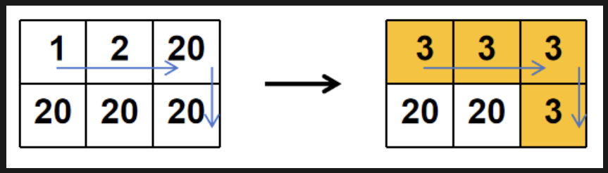
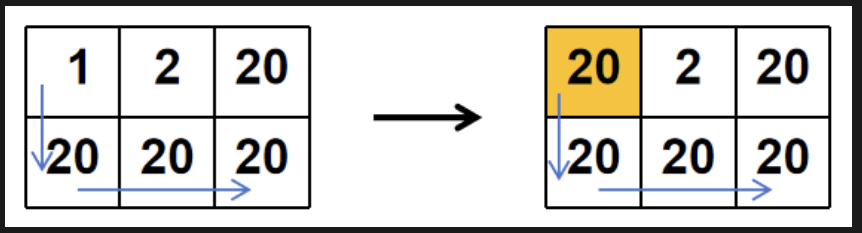

# P5118.第3题-最小颜色修改代价
## 时间限制
1000ms
## 题目内容
有一个 $N \times M$ 的网格，每个格子存一个颜色值（1 到 $C$ 正整数）。小明从左上角 $(0,0)$ 出发，只能向右或向下移动到右下角 $(N - 1, M - 1)$。
如果路径上格子的颜色不同，需要支付代价来改变格子的颜色，使该路径上的格子颜色值相同。改变一个格子的颜色代价为 $|新颜色值-原颜色值|$。
求从 $(0,0)$ 到 $(N - 1, M - 1)$ 的最小总修改代价。(行和列均从 0 开始)

## 输入描述
第一行：三个整数 $N,M,C$
$N$：矩阵行数 $(1 \le N \le 50)$
$M$：矩阵列数 $(1 \le M \le 50)$
$C$：可选颜色数 $(1 \le C \le 50)$
接下来 $N$ 行，每行 $M$ 个整数，表示矩阵每个格子的颜色值 $a_{ij}\ (1 \le a_{ij} \le C)$

## 输出描述
输出一个整数，表示最小总修改代价

## 样例1
### 输入
```
3 3 3
2 3 3
1 2 3
2 3 1
```
### 输出
```
3
```
### 说明
如路径 $(0,0) \to (0,1) \to (0,2) \to (1,2) \to (2,2)$，可将格子的颜色都修改为 3，修改代价如下：

$(0,0)$ 从 2 改为 3，代价为 $|3 - 2| = 1$
$(0,1)$ 颜色值为 3，无需修改，代价为 0
$(0,2)$ 颜色值为 3，无需修改，代价为 0
$(1,2)$ 颜色值为 3，无需修改，代价为 0
$(2,2)$ 从 1 改为 3，代价为 $|3 - 1| = 2$
该路径颜色都改为 3 的总修改代价为 $1+0+0+0+2=3$
同理，该路径将格子颜色修改为 1 和 2 的总修改代价分别为 7 和 4，因此该路径的最小总修改代价为 3
同理，得到其他路径的最小修改代价，取最小总修改代价最小的路径的总修改代价，结果为 3

## 样例2
### 输入
```
2 3 20
1 2 20
20 20 20
```
### 输出
```
19
```
### 说明
如路径 $(0,0) \to (0,1) \to (0,2) \to (1,2)$，可将格子的颜色都修改为 20，修改代价如下：

$(0,0)$ 从 1 改为 3，代价为 $|3 - 1| = 2$
$(0,1)$ 从 2 改为 3，代价为 $|3 - 2| = 1$
$(0,2)$ 从 20 改为 3，代价为 $|3 - 20| = 17$
$(1,2)$ 从20改为 3，代价为 $|3 - 20| = 17$
该路径颜色都改为 3 的总修改代价为 $2 + 1 + 17 + 17 = 37$
同理，可以得到：该路径上，将格子颜色都改为 $[2,20]$ 之间的任一整数，总修改代价最小，均为 37，因此该路径的最小总修改代价为 37
同理，观察其他路径的最小总修改代价：
路径 $(0,0) \to (0,1) \to (1,1) \to (1,2)$：颜色值都为 $[2,20]$ 之间的任一整数，总修改代价为 37
路径 $(0,0) \to (1,0) \to (1,1) \to (1,2)$：颜色值都为 20，总修改代价为 19
因此，总修改代价最小的路径为 $(0,0) \to (1,0) \to (1,1) \to (1,2)$，且将格子颜色都改为 20，结果为 19