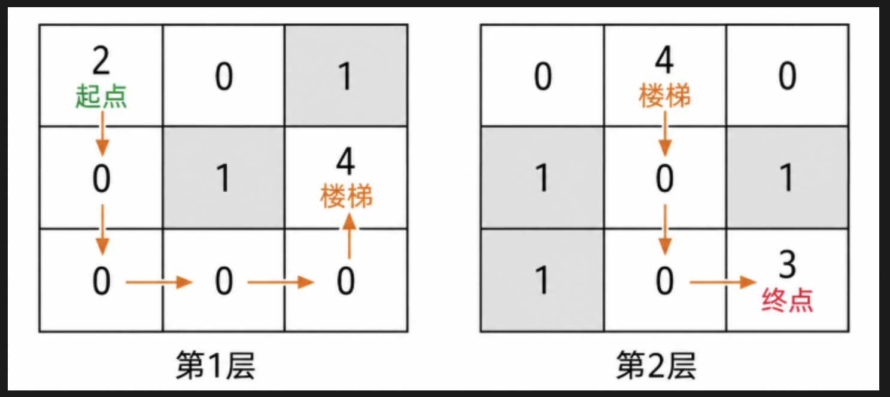
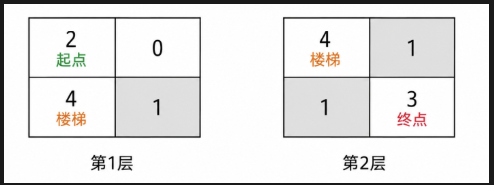

# P5115.第3题-楼内救人
## 题目内容
游戏地图是一个 $m \times n \times 2$ 的2层楼地图，每个格子含义：
- `0`：空地（可通行）
- `1`：墙壁（不可通行）
- `2`：起点（唯一，可在任意一层）
- `3`：终点（唯一，可在任意一层，可与起点同层）
- `4`：楼梯（每层楼有且只有1个）

玩家从起点出发，每次只能上下左右移动一格，不能穿墙。
- 通过楼梯跨层算 **1步**，除此之外不能跨楼层移动
- 求起点到终点的最短路径步数；无法到达则返回 `-1`
- 起点、终点、楼梯所在位置互不重叠

## 输入描述
- 第1行：$m\ n$ （$2 \le m,n \le 256$）
- 接下来 $m$ 行：第1层地图
- 再接下来 $m$ 行：第2层地图

## 输出描述
输出最短路径长度；无法到达则输出 `-1`

## 样例1
### 输入
```
3 3
2 0 1
0 1 4
0 0 0
0 4 0
1 0 1
1 0 3
```
### 输出
```
9
```
### 说明

从第一层的 (0,0) 出发：
(0,1) → (0,2) → (1,2) → (2,2) → (2,1)（楼梯，5步）→ 上楼（1步）
第二层：(1,0) → (1,1) → (1,2) → (2,2) 到目标（3步）
合计：$5+1+3=9$ 步

## 样例2
### 输入
```
2 2
2 0
4 1
4 1
1 3
```
### 输出
```
-1
```
### 说明

不存在合法可达路径，返回 `-1`