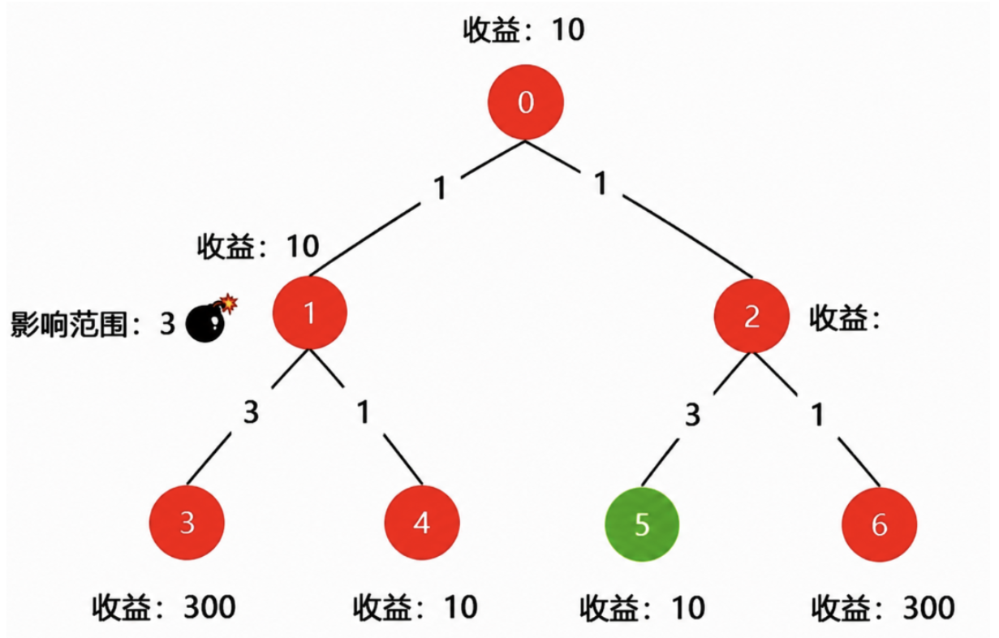
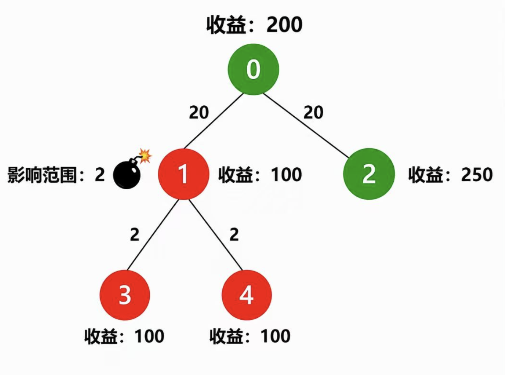

# P5105.第2题-爆破小游戏
1000ms

## 题目内容
云小核正在玩爆破小游戏，游戏地图是一棵树，每个节点有爆破收益值，节点间带距离权值的边相连。
炸弹可放置在任意节点，与放置点距离（路径边权之和）≤影响范围K的节点都会被爆破，总收益为所有爆破节点收益之和。需要选出最优放置节点，使得总收益最大。

## 输入描述
- 第 1 行：两个整型数值，N 和 K，$1\le N\le100$ 表示节点数量，$1\le K\le100000000$ 表示炸弹影响范围
- 第 2 行：N 个整型数值，$g_1,g_2,...,g_N$，$0\le g_i\le1000000$，表示每个节点对应的收益
- 接下来 N-1 行：三个整型数值，$n_i,n_j,d_k$，$0\le n_i,n_j\le N-1$，$0\le d_k\le1000000$，表示节点和节点之间有条边，距离为 $d_k$

## 输出描述
一个整型数值，表示获得的最大收益

### 样例1
输入
```
7 3
10 10 10 300 10 10 300
0 1 1
0 2 1
1 3 3
1 4 1
2 5 3
2 6 1
```
输出
```
640
```

### 样例2
输入
```
5 2
200 100 250 100 100
1 0 20
0 2 20
3 1 2
4 1 2
```
输出
```
300
```
